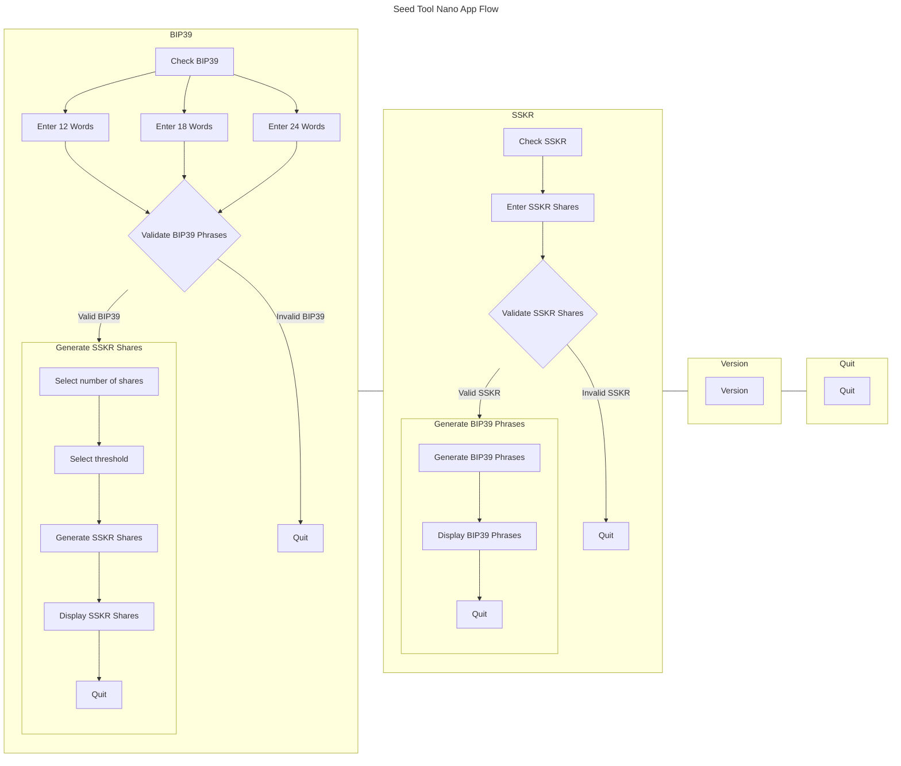
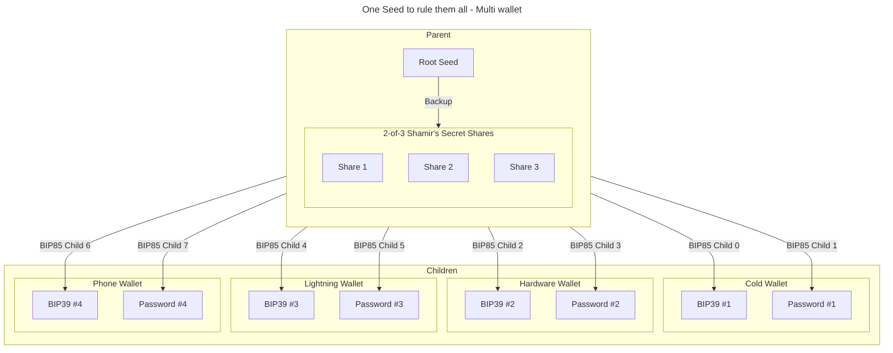
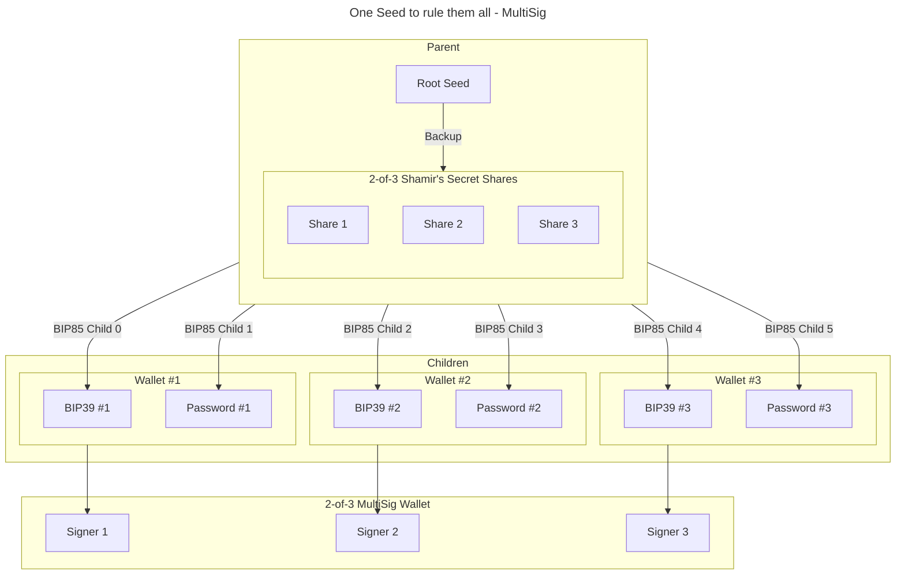

# Seed Tool: A Ledger application that provides some useful seed management utilities

---

Use the utilities provided by this Ledger application to check a backed up seed or generate [Shamir's Secret Sharing (SSS)](https://en.wikipedia.org/wiki/Shamir%27s_secret_sharing) for a seed.

## Check BIP39
The application invites the user to type a [BIP-39](https://github.com/bitcoin/bips/blob/master/bip-0039.mediawiki) mnemonic on their Ledger device. The BIP-39 mnemonic is compared to the onboarded seed and the application notifies the user whether both seeds match or not.

## Generate Shamir's secret sharing
When the seed is validated, the user can create [Shamir's secret sharing (SSS)](https://en.wikipedia.org/wiki/Shamir%27s_secret_sharing) from the BIP-39 phrase that they provided.
The application uses [Sharded Secret Key Reconstruction (SSKR)](https://github.com/BlockchainCommons/Research/blob/master/papers/bcr-2020-011-sskr.md), an interoperable implementation of [Shamir's Secret Sharing (SSS)](https://en.wikipedia.org/wiki/Shamir%27s_secret_sharing). This provides a way for you to divide or 'shard' the master seed underlying a Bitcoin HD wallet into 'shares', which you can then distribute to friends, family, or fiduciaries. If you lose your seed, you can reconstruct it by collecting a sufficient number of your shares (the 'threshold'). Knowledge of fewer than the required number of parts ensures that information about the master secret is not leaked.

* SSKR phrases use a dictionary of exactly 256 English words with a uniform word size of 4 letters
* SSKR encodes a [CBOR] structure tagged with the data type [URTYPES], and is therefore self-describing.
* Phrases generated by SSKR can be up to 46 words in length i.e. 184 characters.
* Only two letters of each word (the first and last) are required to uniquely identify each byte value, making a minimal [ByteWords](https://github.com/BlockchainCommons/Research/blob/master/papers/bcr-2020-012-bytewords.md) encoding as efficient as hexadecimal (2 characters per byte) and yet less error prone.
* Additionally, words can be uniquely identified by their first three letters or last three letters
* Minimizing the number of letters for each word simplifies transfer to permanent media such as stamped metal

For more information about SSKR, see [SSKR for Users](https://github.com/BlockchainCommons/crypto-commons/blob/master/Docs/sskr-users.md).

> [!NOTE]
> SSKR is non-deterministic. There is a random factor introduced when the shares are created, which means that every time you generate shares they will be different. This is an expected and correct result.

> [!TIP]
> Generated Shamir's Secret Shares may be cheaply and safely backed up to a steel wallet using the methods described [here](https://blockmit.com/english/guides/diy/make-cold-wallet-washers/), [here](https://jlopp.github.io/metal-bitcoin-storage-reviews/reviews/safu-ninja/) or [here](https://github.com/BlockchainCommons/crypto-commons/blob/master/Docs/sskr-cold-storage.md). This will keep your backup safe in event of fire, flood or natural disaster.

## Check Shamir's secret shares
The Ledger application also provides an option to confirm the onboarded seed against SSKR shares.

## Generate [BIP85](https://github.com/bitcoin/bips/blob/master/bip-0085.mediawiki)
Coming soon!!!!

## Ledger Nano application menus

## [BIP85](https://github.com/bitcoin/bips/blob/master/bip-0085.mediawiki)
BIP85 allows you to do crazy stuff like this:

