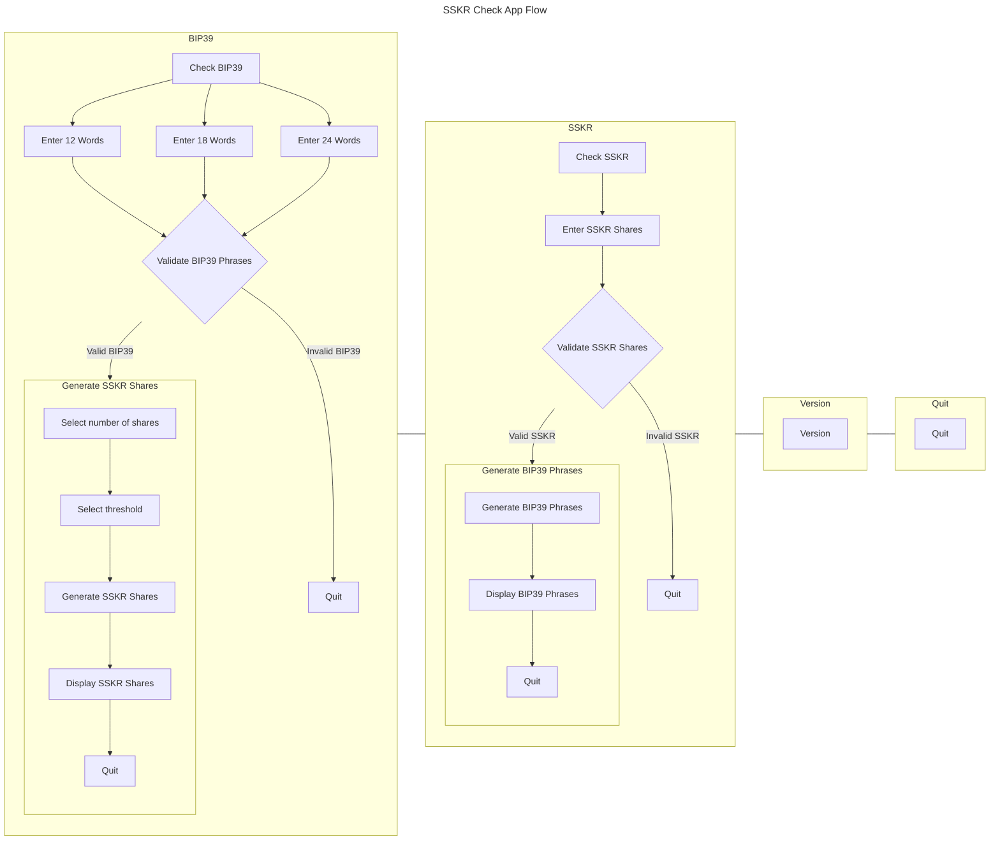

# Ledger Application providing some useful seed management utilities

This Ledger application provides some utilities for checking a backed-up seed or generating [Shamir's Secret Shares (SSS)](https://en.wikipedia.org/wiki/Shamir%27s_secret_sharing) of a seed.

## Check BIP39
The application invites the user to type a [BIP-39](https://github.com/bitcoin/bips/blob/master/bip-0039.mediawiki) mnemonic on their Ledger device, this is compared against the onboarded seed and the user is informed whether both seeds are matching or not.

## Generate Shamir's Secret Shares
Once the seed is validated the user is offered the option to create [Shamir's Secret Shares (SSS)](https://en.wikipedia.org/wiki/Shamir%27s_secret_sharing) from the BIP-39 phrase they provided.
The application uses [Sharded Secret Key Reconstruction (SSKR)](https://github.com/BlockchainCommons/Research/blob/master/papers/bcr-2020-011-sskr.md), an interoperable implementation of [Shamir's Secret Sharing (SSS)](https://en.wikipedia.org/wiki/Shamir%27s_secret_sharing). It is a way that you can divide ("shard") the master seed underlying a Bitcoin HD wallet into "shares", which you can then distribute to friends, family, or fiduciaries. If you ever lose your seed, you can then "reconstruct" it by collecting a sufficient number of your shares (the "threshold"). Knowledge of fewer than the required number of parts does not leak information about the master secret.

Further explanation of SSKR may be found [here](https://github.com/BlockchainCommons/crypto-commons/blob/master/Docs/sskr-users.md).

## Check Shamir's Secret Shares
The application also provides an option to confirm the onboarded seed against SSKR shares. 

## Generate [BIP85](https://github.com/scgbckbone/bips/blob/passwords/bip-0085.mediawiki)
Coming soon!!!! 

## Application Menus

